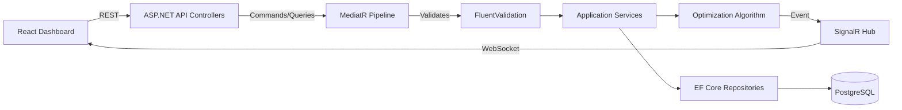

# 🚛 AlgoFreight

**An intelligent fleet dispatch engine that optimizes cargo-to-truck loading using classical optimization algorithms — with AI-assisted cargo intake.**

[](https://dotnet.microsoft.com/)
[](https://react.dev/)
[](https://www.postgresql.org/)
[](./LICENSE)
[]()

---

## 🎬 Live Preview


> 🔗 **Live Demo:** [algofreight.vercel.app](https://algofreight.vercel.app) — hosted on free tiers, so the first request after inactivity may take up to a minute while the backend wakes up.

---

## 🏢 Enterprise Features

AlgoFreight isn't built like a typical student CRUD project — it applies patterns used in production enterprise systems:

- **CQRS & Clean Architecture** — Strict separation of reads and writes via [MediatR](https://github.com/jbogard/MediatR): controllers dispatch `Commands`/`Queries` instead of calling services directly, with a `FluentValidation` pipeline behavior enforcing input validation centrally before any handler runs, and a global `IExceptionHandler` producing consistent RFC 7807 `ProblemDetails` error responses across the entire API.
- **Real-Time Telemetry** — SignalR (WebSockets) pushes `"DispatchCompleted"` events to the dashboard the instant an optimization run finishes, with no HTTP polling. A connection status badge and graceful reconnect handling keep the UI honest about backend availability, including free-tier cold starts.
- **AI "Review & Diff" Intake** — The Gemini API parses free-text cargo descriptions into structured fields, but nothing reaches the database automatically. A strict **parse-then-confirm** flow shows the AI-derived fields in an editable preview card, requiring an explicit user confirmation before the record is committed — unverified AI output never silently touches production data.
- **Transactional Integrity** — Dispatch runs that create a manifest and update multiple cargo records are wrapped in an explicit database transaction, so a mid-operation failure rolls back cleanly instead of leaving orphaned records.
- **Production Resilience** — Rate limiting on the AI intake and dispatch endpoints, structured logging with message templates (never logging secrets), and a documented retry policy around the Gemini API for transient failures.

---

## 📌 Overview

AlgoFreight simulates a real-world logistics dispatch problem: given a pool of **pending cargo** (weight, destination, priority, fragility) and a fleet of **available trucks** (capacity, route), it computes an optimal — or near-optimal — loading plan that maximizes delivered priority/value while respecting weight constraints.

This isn't another CRUD app. The core of AlgoFreight is a **greedy multi-knapsack / bin-packing algorithm** written in C#, wrapped in a clean, layered ASP.NET Core API, with a real-time React dashboard that updates the moment a dispatch run completes.

> Built as a portfolio project to demonstrate algorithmic problem-solving, clean architecture, and full-stack engineering — not just framework familiarity.

---

## ✨ Key Features

- 📦 **Cargo & Fleet Management** — CRUD for pending cargo and truck fleet, with weight/priority/destination metadata
- 🧮 **Optimization Engine** — Greedy multi-truck loading algorithm (First-Fit Decreasing by priority-density), with an optional single-truck 0/1 Knapsack (exact DP) mode for comparison
- ⚡ **Real-Time Dashboard** — SignalR pushes "Optimization Complete" events to the frontend the instant a dispatch run finishes — no polling
- 🤖 **AI-Assisted Cargo Intake** — Natural-language cargo entry (e.g. *"200kg electronics to Chittagong, urgent, fragile"*) parsed into structured fields via LLM, before being handed to the deterministic algorithm
- 📊 **Dispatch History & Audit Trail** — Every optimization run and manifest is persisted and viewable
- 🐳 **One-Command Local Setup** — Full stack (API + DB + frontend) via Docker Compose

---

## 🏗️ Architecture



**Layers:**
- **Controllers** — exceptionally thin: construct a Command/Query from the HTTP request, dispatch it via `IMediator.Send()`, map the result to a response. No business logic, no direct repository or `DbContext` access.
- **MediatR Pipeline** — every Command/Query passes through a `ValidationBehavior` that runs its paired `FluentValidation` validator before the request ever reaches a handler; failures short-circuit into a standardized `ProblemDetails` (400) response via a global `IExceptionHandler`.
- **Application Services** — pure business logic (the optimization engine, the Gemini parser) invoked from within Command/Query handlers, independently unit-testable without HTTP or a real database.
- **Optimization Engine** — the greedy and exact-knapsack algorithms, pure functions with no I/O.
- **EF Core Repositories** — data access abstracted behind interfaces; multi-step writes (e.g. a dispatch run) are wrapped in an explicit database transaction for atomicity.
- **SignalR Hub** — broadcasts dispatch completion events over WebSocket, decoupled from the Application layer so business logic stays testable without a live Hub connection.

---

## 🧰 Tech Stack

| Layer | Technology |
|---|---|
| Backend | ASP.NET Core Web API (C#) |
| Architecture | CQRS via MediatR, FluentValidation pipeline, global `IExceptionHandler` |
| ORM | Entity Framework Core (Code-First) |
| Database | PostgreSQL |
| Real-time | SignalR |
| Frontend | React + TypeScript + Tailwind CSS |
| AI Integration | Gemini API (natural-language cargo parsing, parse-then-confirm) |
| Containerization | Docker & Docker Compose |
| Hosting | Azure App Service (backend) · Vercel (frontend) · Neon (DB) |

---

## 📂 Project Structure

```
AlgoFreight/
├── backend/
│   ├── AlgoFreight.Api/            # Controllers, Program.cs, DI setup
│   ├── AlgoFreight.Application/    # Services, DTOs, optimization engine
│   ├── AlgoFreight.Domain/         # Entities, enums, core models
│   ├── AlgoFreight.Infrastructure/ # EF Core, repositories, migrations
│   └── AlgoFreight.Tests/          # xUnit tests
├── frontend/
│   ├── src/
│   │   ├── components/
│   │   ├── pages/
│   │   ├── hooks/
│   │   └── services/                # API client, SignalR connection
│   └── ...
├── docker-compose.yml
├── .github/
│   ├── workflows/                   # CI pipelines
│   ├── ISSUE_TEMPLATE/
│   └── PULL_REQUEST_TEMPLATE.md
├── docs/
│   └── screenshots/
├── CONTRIBUTING.md
├── CHANGELOG.md
├── LICENSE
└── README.md
```

---

## 🚀 Getting Started

### Prerequisites
- [.NET 8 SDK](https://dotnet.microsoft.com/download)
- [Node.js 20+](https://nodejs.org/)
- [Docker Desktop](https://www.docker.com/products/docker-desktop/)
- PostgreSQL (or use the provided Docker Compose service)

### Run locally with Docker Compose
```bash
git clone https://github.com/<your-username>/AlgoFreight.git
cd AlgoFreight
docker-compose up --build
```
- Frontend: `http://localhost:3000`
- API + Swagger docs: `http://localhost:5000/swagger`

### Manual setup (without Docker)
```bash
# Backend
cd backend/AlgoFreight.Api
dotnet restore
dotnet ef database update
dotnet run

# Frontend
cd frontend
npm install
npm run dev
```

### Environment variables
Copy `.env.example` to `.env` in both `backend/` and `frontend/` and fill in:
```
POSTGRES_CONNECTION_STRING=
GEMINI_API_KEY=
JWT_SECRET=
```

---

## 🧮 The Algorithm

AlgoFreight implements two strategies, selectable per dispatch run:

1. **Greedy First-Fit Decreasing (default, multi-truck)** — sorts cargo by priority-to-weight density, assigns each item to the first truck with sufficient remaining capacity. Runs in `O(n log n)`, scales to thousands of cargo items, and is the practical choice for real-time dispatch.
2. **Exact 0/1 Knapsack (single-truck mode, DP)** — for a single truck and cargo pool, computes the provably optimal subset maximizing total priority within weight capacity. Included to demonstrate the exact-vs-approximate tradeoff explicitly.

> Multi-truck bin-packing is NP-hard in general; the greedy approach is a deliberate, documented tradeoff for real-time performance rather than a claim of guaranteed global optimality.

### Performance Benchmarks

| Algorithm | Dataset | Time Complexity | Avg. Execution Time | Optimal? |
|---|---|---|---|---|
| Greedy First-Fit Decreasing | 10,000 Cargo / 50 Trucks | `O(n log n)` | < 45 ms | No (approximation) |
| Exact 0/1 Knapsack (DP) | 500 Cargo / 1 Truck | `O(n · W)` | ~ 120 ms | Yes (exact) |

*Benchmarks measured via the `ExecutionTimeMs` field returned on every `DispatchResult`, and validated against the 5,000-item performance sanity test in the test suite. This table exists to make the speed-vs-optimality tradeoff between the two strategies concrete rather than theoretical.*

---

## 🗺️ Roadmap

- [ ] Multi-destination route optimization
- [ ] Historical analytics dashboard (utilization trends over time)
- [ ] Configurable optimization weights (priority vs. distance vs. fragility)
- [ ] Auth roles: Dispatcher / Fleet Manager / Admin

---

## 🤝 Contributing

Contributions, issues, and feature requests are welcome. See [CONTRIBUTING.md](./CONTRIBUTING.md) for guidelines.

## 📄 License

This project is licensed under the MIT License — see [LICENSE](./LICENSE) for details.

## 👤 Author

**Mugdho**
Computer Science & Engineering Undergraduate — Ahsanullah University of Science and Technology (AUST)

- GitHub: [FazleRabbiMugdho](https://github.com/FazleRabbiMugdho)
- LinkedIn: [linkedin.com/in/md-fazle-rabbi-mugdho](https://linkedin.com/in/md-fazle-rabbi-mugdho)
